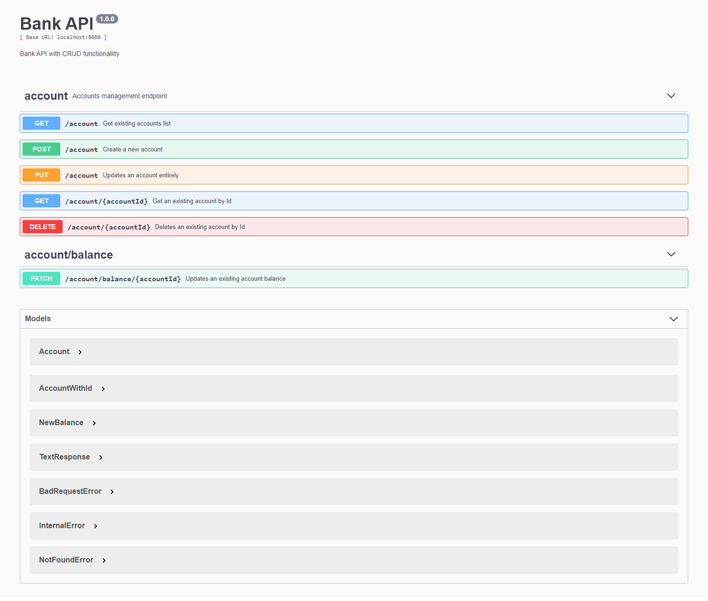

# Bank API with CRUD functionallity

This project is about a CRUD API that deals with accounts data structure. It uses a .json file for storing data. 



## What was used in this project:

 - Language: Javascript(ES6+) 
 - Stack: Nodejs + Express
 - Documentation: Swagger
 - Log lib: Winston

## Running this project locally

 - 1 - Download or clone this project and rename .env.example to .env, setting variables to:

```yaml
    DATA_PATH="data"
    DATA_LOCATION="data/accounts.json"
    PORT=8080
```

 - 2 - Open a terminal in project´s root folder and run the following commands:

- ```$ npm install```
- ```$ npm install -g nodemon``` (if nodemon isn´t installed)
- ```$ nodemon```

Now API can be consumed in **localhost:8080** and Swagger docs can be viewed in **localhost:8080/swagger**

## Consuming the API

You can test this API by browsing the Swagger documentation provided here. If you prefer, you can also
create requests to API endpoints by using applications like Insomnia or Postman. Here is the list of
http verbs followed by the available endpoints:

- ```GET /account``` - Fetches all accounts
- ```GET /account/{id}``` - Fetches an account by Id
- ```POST /account``` - Creates a new account
- ```PUT /account``` - Updates an account entirely
- ```DELETE /account/{id}``` - Deletes an account
- ```PATCH /account/withdraw/{id}``` - Withdraws from accounts
- ```PATCH /account/deposit/{id}``` - Deposits on accounts
- ```PATCH /account/transfer?fromAccountWithId={fromId}&toAccountWithId={toId}``` - Transfers between accounts

## Key Features

 - Routing for CRUD operations with REST verbs
 - Data persistence in a .json file
 - Daily logs with configured levels
 - Fully documented with Swagger
 - Errors handling with API´s custom messages

