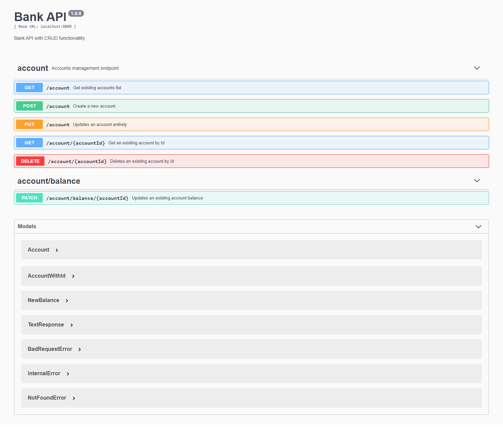

# Bank API with CRUD functionality

This project is a RESTful API that manages bank accounts data structures. It uses a JSON file for data persistence.



## Technology Stack

- Language: TypeScript
- Runtime: Node.js
- Framework: Express
- Documentation: OpenAPI 3.0 (Swagger)
- Logging: Winston
- Testing: Jest

## Features

- RESTful API with CRUD operations
- Persistent data storage using JSON files
- Daily logging with configurable levels
- Comprehensive API documentation with Swagger
- Error handling with custom error messages
- TypeScript for type safety and better developer experience

## Documentation

Detailed documentation is available in the [docs](./docs) directory:

- [Architecture Overview](./docs/architecture.md)
- [API Endpoints](./docs/api-endpoints.md)
- [Error Handling](./docs/error-handling.md)
- [Logging](./docs/logging.md)
- [Data Storage](./docs/data-storage.md)
- [Express Implementation](./docs/express-implementation.md)
- [Environment Configuration](./docs/environment-configuration.md)

## Running this project locally

1. Clone this repository
2. Set up environment variables:

```bash
# Copy the example env file
npm run prepare-env
```

This will create a `.env` file with the default values.

3. Install dependencies and run the project:

```bash
# Install dependencies
npm install

# For development (with auto-reload)
npm run dev

# For production (build first)
npm run build
npm start
```

The API will be available at **http://localhost:8080** and Swagger documentation at **http://localhost:8080/swagger**

## API Endpoints

- `GET /account` - Fetch all accounts
- `GET /account/{id}` - Fetch an account by ID
- `POST /account` - Create a new account
- `PUT /account` - Update an account entirely
- `DELETE /account/{id}` - Delete an account
- `PATCH /account/withdraw/{id}` - Withdraw from account
- `PATCH /account/deposit/{id}` - Deposit to account
- `PATCH /account/transfer?fromAccountWithId={fromId}&toAccountWithId={toId}` - Transfer between accounts

## Development

### Building the project
```bash
npm run build
```

### Linting
```bash
npm run lint
```

### Running tests
```bash
npm test
```

## Key Features

- Type-safe codebase with TypeScript
- Modular architecture with separation of concerns
- Comprehensive error handling
- API documentation with Swagger/OpenAPI 3.0
- Environment-based configuration
- Unit tests with Jest
- Development workflow with nodemon
